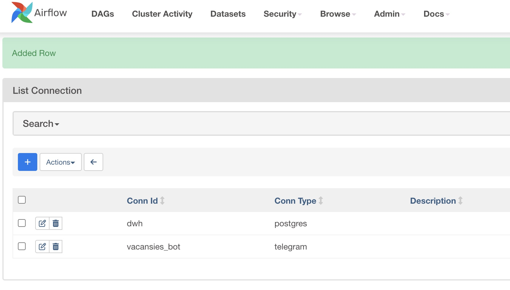
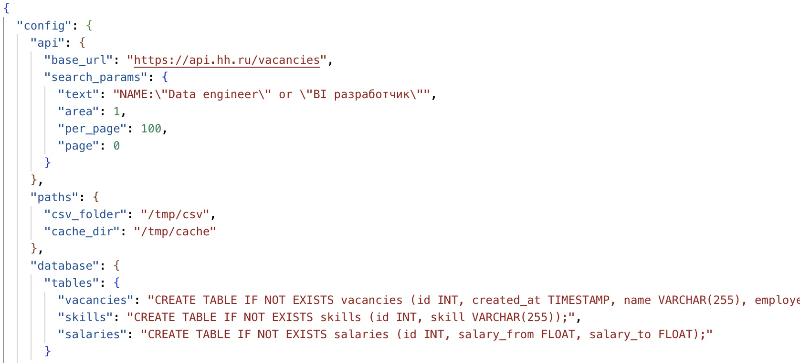
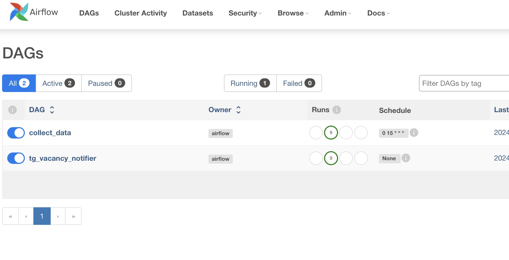
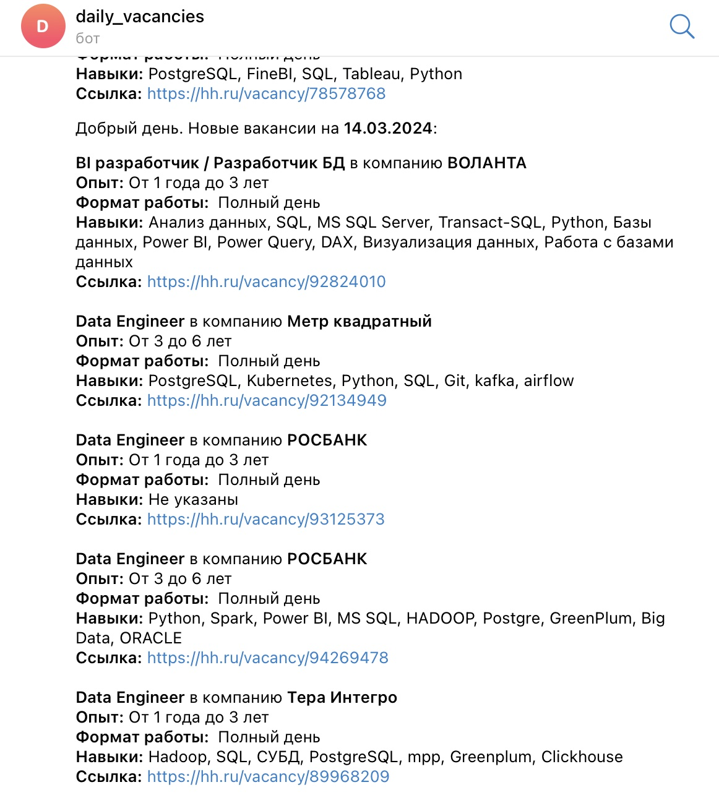

# Автоматизация поиска и рассылки вакансий с hh.ru

## Идея
Автоматизировать поиск вакансий по выбранным критериям. Скрипт парсит вакансии по API и загружает информацию в базу данных. Далее происходит ежедневная рассылка новых вакансий на текущую дату при помощи телеграм бота.

## Инфраструктура
- **Postgres** - для загрузки информации о вакансиях.
- **pgAdmin** - для управления базой данных.
- **Airflow** - для запуска скрипта по расписанию.
- **Телеграм бот** - для рассылки "свежих" вакансий.

## Зависимости
- **Pandas** - для преобразования данных.
- **Requests** - для парсинга вакансий по API.

Вся инфраструктура собрана в докер контейнеры.

## Установка
1. Сделать форк репозитория и склонировать репозиторий.
2. Установить Docker desktop.
3. Перейти в директорию deploy и запустить в терминале `docker-compose up -d`.
4. Настроить подключения в Airflow через Connections (`conn_id=dwh`) и pgAdmin. Для перехода в Airflow указать в браузере `localhost:8080`, pgAdmin - `localhost:80`. Детали подключений указаны в `/airflow_data/scripts/dwh.env`).
5. Создать телеграм бота для получения рассылки с вакансиями (получить токен бота и chat_id).
6. Создать подключение к телеграм боту в Airflow через Connections (`conn_id=vacancies_bot`).

## Параметризация
Основные параметры указаны в файле `config.json` (`/airflow_data/scripts/`):
- `base_url` - адрес для подключения по API;
- `text` - поисковой запрос для вакансий (по умолчанию ищем вакансии "Data Engineer" или "BI разработчик");
- `area` - локация по запросу (по умолчанию указана цифра 1 - Москва, справочник локаций в виде json по ссылке - https://api.hh.ru/areas/113/);
- `per_page` - количество вакансий на одной странице (по умолчанию стоит цифра 100 вакансий на 1 страницу);
- `page` - начальная страница поиска (указана 0 - поиск ведется с первой страницы).

Дополнительно с API HH можно ознакомиться тут: [https://github.com/hhru/api](https://github.com/hhru/api)

## Работа системы
После поднятия контейнеров и настройки необходимых подключений, нужно скорректировать (при необходимости) поисковой запрос в файле `config.json`, а затем загрузить json в Airflow через Variables. После загрузки переменных в Airflow должно отобразиться 2 дага:
1. `collect data`
2. `tg_vacancy_notifier`

Dag `collect_data` обращается по API к HH, находит все страницы согласно поискову запросу (`config.json`), выгружаются детали всех вакансий и формируются три таблицы:
- `vacancies`: id вакансии, дата создания, название вакансии, работодатель, формат (офис/удаленка), необходимый опыт, описание, ссылка на страницу вакансии HH. Поле "описание" очищается от html-тегов отдельной функцией.
- `skills`: id вакансии, список необходимых навыков.
- `salary`: id вакансии, зп_от, зп_до. В данной таблице указаны вакансии, по которым указан доход. Сумма дохода указана как реальная зарплата "на руки" (преобразование в отдельной функции).

Первая выгрузка может занимать продолжительное время (в зависимости от объема вакансий), так как каждая вакансия обрабатывается впервые. Информация загружается в кэш и повторная выгрузка будет занимать гораздо меньше времени за счет обращения к папке кэш. Также предусмотрена функция очистки кэша от неактуальных вакансий.

После отработки всех этапов dag `collect_data` вызывает даг `tg_vacancy_notifier`, который обращается к информации по вакансиям, загруженным в БД, выгружает вакансии с текущей датой и отправляет сообщение в телеграм бот с основной информацией о вакансиях.

## Проблемы (пока не решены)
Сообщения при отправке в телеграм чат разбиваются на группы (не более n вакансий в одном сообщении), так как предельный объем одного сообщения < 4 тыс.симолов.
Телеграм периодически их дублирует, при этом в логах airflow - все ок.

## Идеи для развития
Подключить BI систему для дополнительной аналитики (какие ключевые навыки требуются на ту или иную позицию, анализ зарплатных вилок, требуемый опыт, динамика размещения вакансий по дням и т.д.)

